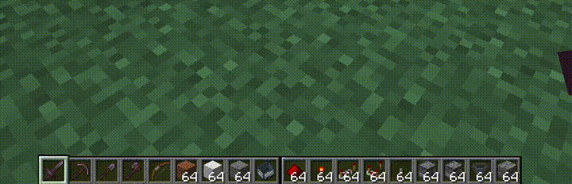

Extended Hotbar
===============

Top bar is the bottom bar of the player's inventory.

* Press `R` to swap the rows
* Press `Shift-R` to swap only the items in your hand. (Disabled by default)
* Press `=` to disable/enable

Hotkeys are configurable in the standard Minecraft controls settings.

Additional configuration is in the mod's menu page. [ModMenu is required for the extra configuration.](https://www.curseforge.com/minecraft/mc-mods/modmenu)

## Fluent Mode

Fluent mode can be enabled in the mod's config menu (using ModMenu). This disabled manual swapping using the `R` key,
and instead does the swapping transparently as the user scrolls along a double-wide hotbar, created by rendering the
second hotbar alongside the first, rather than on top.

