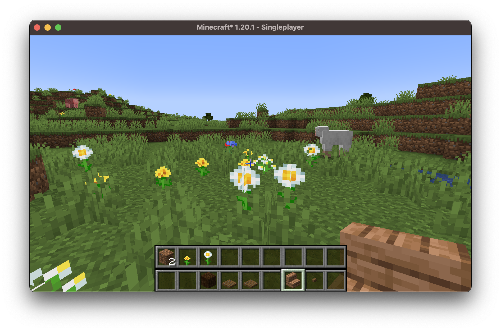

Extended Hotbar
===============

Top bar is the bottom bar of the player's inventory.

* Press `R` to swap the rows
* Press `Shift-R` to swap only the items in your hand.
* Press `=` to disable/enable

Controls are configurable in the standard Minecraft controls settings.

Additional configuration is in the mod's menu page. [ModMenu is required for the extra configuration.](https://www.curseforge.com/minecraft/mc-mods/modmenu)
